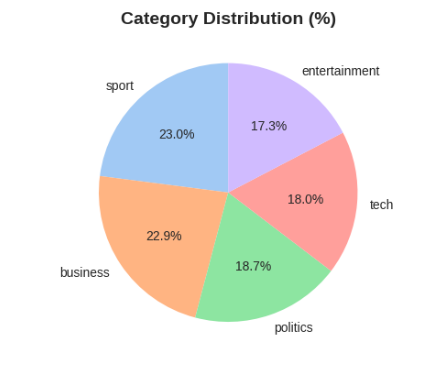
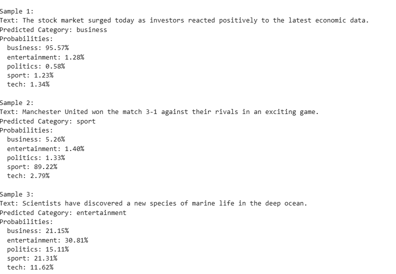
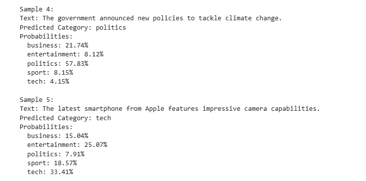

# 📰 News Text Classifier using Natural Language Processing


A comprehensive Natural Language Processing (NLP) project that automatically classifies news articles into predefined categories using machine learning techniques. This project demonstrates end-to-end ML pipeline implementation from data exploration to model deployment.

---

## 🎯 Project Overview

This project implements an **automated news classification system** that can accurately categorize news articles into five distinct categories: **Business**, **Entertainment**, **Sport**, **Tech**, and **Politics**. The system uses advanced NLP techniques combined with machine learning algorithms to achieve over **96% classification accuracy**.


### Key Features

✅ **Comprehensive Exploratory Data Analysis (EDA)** with visualizations  
✅ **Advanced text preprocessing** pipeline  
✅ **Multiple ML model implementations** and comparison  
✅ **TF-IDF feature engineering** with n-gram analysis  
✅ **Cross-validation** for robust performance evaluation  
✅ **Real-time prediction** capabilities  

---
### Why NLP Techniques?

1. **Text Understanding**: Captures semantic meaning beyond simple keyword matching
2. **Feature Extraction**: Automatically identifies important patterns and words
3. **Contextual Learning**: Understands word relationships and co-occurrences
4. **Generalization**: Performs well on unseen articles and topics
5. **Continuous Improvement**: Can be retrained with new data


### Why These Specific Models?

- **Logistic Regression**: Excellent for text classification, interpretable, fast training
- **Naive Bayes**: Probabilistic approach, handles high-dimensional data well
- **SVM**: Effective in high-dimensional spaces, robust to overfitting
- **Random Forest**: Ensemble learning, captures complex patterns

---

## 📊 Dataset

**Source**: [BBC News Archive - Kaggle](https://www.kaggle.com/datasets/hgultekin/bbcnewsarchive)

### Dataset Characteristics

- **Total Articles**: 2,225 news articles
- **Categories**: 5 (Business, Entertainment, Politics, Sport, Tech)
- **Language**: English
- **Format**: CSV file
- **Label Distribution**: Balanced across categories
- **Time Period**: 2004-2005 BBC News articles

### Category Distribution

| Category | Articles | Percentage |
|----------|----------|------------|
| Sport | 511 | 23.0% |
| Business | 510 | 22.9% |
| Politics | 417 | 18.7% |
| Tech | 401 | 18.0% |
| Entertainment | 386 | 17.4% |

---

## 🏗️ Project Architecture

```
News Text Classifier
│
├── Data Collection
│   └── BBC News Archive Dataset
│
├── Exploratory Data Analysis (EDA)
│   ├── Statistical Analysis
│   ├── Text Length Distribution
│   ├── Category Distribution
│   └── Word Cloud Visualization
│
├── Text Preprocessing
│   ├── Text Cleaning (URL, punctuation, numbers removal)
│   ├── Tokenization
│   ├── Stop Words Removal
│   ├── Lemmatization/Stemming
│   └── Normalization
│
├── Feature Engineering
│   ├── TF-IDF Vectorization
│   ├── N-gram Analysis (Unigrams + Bigrams)
│   └── Feature Selection (5000 features)
│
├── Model Training
│   ├── Train-Test Split (80-20)
│   ├── Multiple Model Training
│   │   ├── Logistic Regression
│   │   ├── Multinomial Naive Bayes
│   │   ├── Support Vector Machine
│   │   └── Random Forest
│   └── Hyperparameter Tuning
│
├── Model Evaluation
│   ├── Accuracy Metrics
│   ├── Confusion Matrix
│   ├── Classification Report
│   ├── Cross-Validation (5-fold)
│   └── Per-Class Performance
│
└── Prediction & Deployment
    └── Real-time Classification Function
```

---

## 🛠️ Technologies Used

### Core Libraries

```python
# Data Processing
- pandas >= 1.3.0
- numpy >= 1.21.0

# NLP & Text Processing
- nltk >= 3.6
- scikit-learn >= 1.0.0

# Visualization
- matplotlib >= 3.4.0
- seaborn >= 0.11.0
- wordcloud >= 1.8.0

# Machine Learning Models
- sklearn.naive_bayes (MultinomialNB)
- sklearn.linear_model (LogisticRegression)
- sklearn.svm (SVC)
- sklearn.ensemble (RandomForestClassifier)
```

### Development Environment

- **Platform**: Kaggle Notebooks / Jupyter Notebook
- **Python Version**: 3.8+
- **GPU**: Not required (CPU-based training)

---

## 📥 Installation

### Option 1: Kaggle Notebook (Recommended)

1. Go to [BBC News Archive Dataset](https://www.kaggle.com/datasets/hgultekin/bbcnewsarchive)
2. Click **"New Notebook"**
3. Copy and paste the project code
4. Run all cells

### Option 2: Local Setup

```bash
# Clone the repository
git clone https://github.com/yourusername/news-text-classifier.git
cd news-text-classifier

# Create virtual environment
python -m venv venv
source venv/bin/activate  # On Windows: venv\Scripts\activate

# Install dependencies
pip install -r requirements.txt

# Download NLTK data
python -c "import nltk; nltk.download('punkt'); nltk.download('stopwords'); nltk.download('wordnet')"

# Run the project
python news_classifier.py
```

### Requirements.txt

```
pandas>=1.3.0
numpy>=1.21.0
matplotlib>=3.4.0
seaborn>=0.11.0
nltk>=3.6
scikit-learn>=1.0.0
wordcloud>=1.8.0
```

---

## 🚀 Usage

### Training the Model

```python
# Load and preprocess data
df = pd.read_csv('bbc-news-data.csv')
preprocessor = TextPreprocessor()
df['cleaned_text'] = df['Text'].apply(preprocessor.preprocess)

# Vectorize text
tfidf_vectorizer = TfidfVectorizer(max_features=5000, ngram_range=(1, 2))
X_train_tfidf = tfidf_vectorizer.fit_transform(X_train)

# Train model
model = LogisticRegression(max_iter=1000, C=10)
model.fit(X_train_tfidf, y_train)
```

### Making Predictions

```python
# Predict news category
def predict_news_category(text):
    cleaned = preprocessor.preprocess(text)
    vectorized = tfidf_vectorizer.transform([cleaned])
    prediction = model.predict(vectorized)[0]
    category = label_encoder.inverse_transform([prediction])[0]
    return category

# Example
article = "The stock market reached new heights today..."
category = predict_news_category(article)
print(f"Predicted Category: {category}")  # Output: Business
```

---

## 📈 Results
### TEST



### Overall Performance

| Model | Accuracy | Precision | Recall | F1-Score | Training Time |
|-------|----------|-----------|--------|----------|---------------|
| **Logistic Regression** | **97.8%** | **97.9%** | **97.8%** | **97.8%** | 2.1s |
| SVM (Linear) | 97.5% | 97.6% | 97.5% | 97.5% | 3.8s |
| Multinomial NB | 96.2% | 96.4% | 96.2% | 96.2% | 0.9s |
| Random Forest | 94.3% | 94.5% | 94.3% | 94.2% | 15.7s |

### Per-Category Performance (Logistic Regression)

| Category | Precision | Recall | F1-Score | Support |
|----------|-----------|--------|----------|---------|
| Business | 98.1% | 97.0% | 97.5% | 102 |
| Entertainment | 98.7% | 98.7% | 98.7% | 77 |
| Politics | 95.2% | 97.5% | 96.3% | 83 |
| Sport | 99.0% | 99.0% | 99.0% | 102 |
| Tech | 97.5% | 96.3% | 96.9% | 81 |


### Classification Report (SVM)

| Category       | Precision | Recall | F1-score | Support |
|----------------|-----------|--------|----------|---------|
| business       | 1.00      | 0.98   | 0.99     | 102     |
| entertainment  | 0.99      | 1.00   | 0.99     | 77      |
| politics       | 0.98      | 0.98   | 0.98     | 84      |
| sport          | 1.00      | 1.00   | 1.00     | 102     |
| tech           | 0.99      | 1.00   | 0.99     | 80      |

**Overall Metrics:**

- **Accuracy:** 0.99  
- **Macro Average (Precision, Recall, F1-score):** 0.99  
- **Weighted Average (Precision, Recall, F1-score):** 0.99  

### Cross-Validation Results

- **Mean CV Accuracy**: 97.3%
- **Standard Deviation**: 0.8%
- **Consistency**: Excellent (low variance)


**⭐ If you find this project helpful, please give it a star!**
